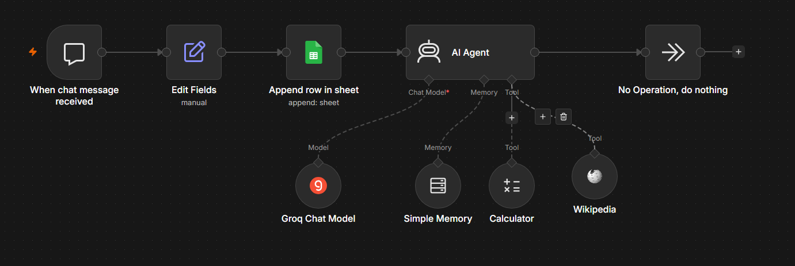

# AI Chat Agent — n8n + Groq + Google Sheets

Interface de chat com agente de IA integrado, construído com Next.js no frontend e n8n como orquestrador do backend. O agente responde com contexto, salva conversas no Google Sheets e tem acesso a ferramentas como calculadora e Wikipedia.

---

## Demo

> Chat funcional rodando em localhost:3000, integrado ao agente n8n em tempo real.

---

## Arquitetura
Usuário (Next.js) → API Route → Webhook n8n → AI Agent (Groq) → Resposta
↓
Google Sheets (log)

**Fluxo completo:**
1. Usuário envia mensagem no chat (Next.js)
2. API Route (`/api/chat`) repassa para o webhook do n8n via HTTP POST
3. n8n processa com o AI Agent (Groq + LLaMA)
4. Conversa é salva automaticamente no Google Sheets
5. Resposta volta ao frontend com contexto da sessão

---

## Fluxo n8n



### Nós configurados

| Nó | Função |
|---|---|
| **When chat message received** | Trigger — recebe a mensagem via webhook |
| **Edit Fields** | Extrai e renomeia os campos `sessionId` e `chatInput` |
| **Append row in sheet** | Salva cada mensagem no Google Sheets para histórico |
| **AI Agent** | Orquestra o processamento com o LLM |
| **Groq Chat Model** | Gera a resposta usando LLaMA via Groq |
| **Simple Memory** | Mantém contexto da conversa entre mensagens |
| **Calculator** | Ferramenta: resolve operações matemáticas |
| **Wikipedia** | Ferramenta: busca informações em tempo real |
| **No Operation** | Encerra o fluxo após resposta |

### Destaques técnicos

- **Memória de sessão** — o agente lembra o contexto de toda a conversa usando o nó Simple Memory vinculado ao `sessionId`
- **AI Agent com tools** — diferente de um fluxo linear, o agente decide autonomamente quando usar a calculadora ou buscar na Wikipedia
- **Log automático** — cada mensagem é registrada no Google Sheets com timestamp para análise posterior

---

## Frontend — Next.js

Interface mobile-first simulando um app de chat, integrada ao agente n8n em tempo real.

### Tecnologias

- **Next.js 15** — framework React com App Router
- **TypeScript** — tipagem estática
- **API Route** (`/api/chat`) — proxy entre o frontend e o webhook n8n
- **CSS Variables** — design system consistente

### Como funciona a integração

```ts
// app/api/chat/route.ts
const response = await fetch(N8N_WEBHOOK_URL, {
  method: "POST",
  body: JSON.stringify({
    action: "sendMessage",
    sessionId: sessionId,  // mantém contexto por sessão
    chatInput: message,
  }),
});
```

---

## Como rodar localmente

```bash
# Clone o repositório
git clone https://github.com/carlosqbarbosa/autoflow-chatbot.git
cd autoflow-chatbot

# Instale as dependências
npm install

# Rode o projeto
npm run dev
```

Acesse: [http://localhost:3000](http://localhost:3000)

> **Requisito:** o fluxo n8n precisa estar publicado (botão "Publish" no n8n) para o chat funcionar.

---

## Stack completa

| Camada | Tecnologia |
|---|---|
| Frontend | Next.js 15 + TypeScript |
| Orquestração | n8n |
| LLM | Groq (LLaMA 3) |
| Memória | n8n Simple Memory |
| Log de conversas | Google Sheets |
| Ferramentas do agente | Calculator + Wikipedia |
| Deploy frontend | Vercel |

---

## Estrutura do projeto
autoflow-chatbot/
├── app/
│   ├── api/
│   │   └── chat/
│   │       └── route.ts      ← proxy para o webhook n8n
│   ├── components/
│   │   └── Chatbot.tsx       ← interface do chat
│   ├── globals.css
│   ├── layout.tsx
│   └── page.tsx
├── public/
│   └── fluxo-n8n.png         ← print do workflow n8n
└── README.md

---
